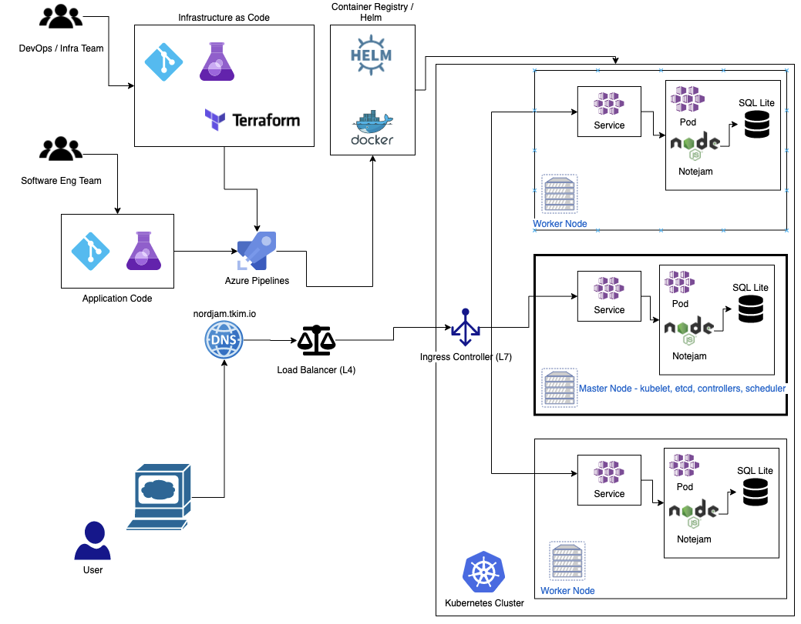

[](https://dev.azure.com/tomkim22/nord-devops/_build/latest?definitionId=9&branchName=master)

# Welcome to Nord-Jam

[Demo @ https://nordjam.tkim.io](https://nordjam.tkim.io)

### Demo Architecture



## Requirements

- [Docker](https://docs.docker.com/get-docker/)
- [Git](https://git-scm.com/book/en/v2/Getting-Started-Installing-Git)

## Run locally

```docker run -p 3000:3000 tkimm/nord-se-js:1.0.0```
- Navigate to ```127.0.0.1:3000```

## Local Build Instructions

- Clone this repository
- ```cd nord-se-js```
- ```docker build . -t nord-se-js:dev```

# To be updated

- Clean up [Azure Pipeline](https://dev.azure.com/tomkim22/nord-devops)
- Explain rationale e.g Different architecture depending on client budget, hybrid, technical capacity of incumbent team, load, region availability.
- Insert schematic (current / future state with decoupling) e.g serve static assets from CDN, extract middleware, migrate to more robust database, use database as managed service or host as stateful set in k8s, workflow, canary / a/b testing.
- If time persists rewrite with view / middleware / db seperated into microservice architecture
- Update tests instructions 
- Explain key vault, secret injection, sops, gpg, rbac and reducing attack vector
- Explain dummy coverage
- Provide, diff architectures, Azure Container Instance / Azure Serverless / Web App (Scaled App Service Plan) / Docker-Compose 
- Explain separation of workflow, Software Engineering and DevOps, trunk based branch strategy.
- Add in pulumi or terraform examples
- Explain usage of distroless base images for smaller more secure builds.
- Explain usage of Docker Hub + Personal cluster (No more Azure credits/Have to set up service principals certs etc)
